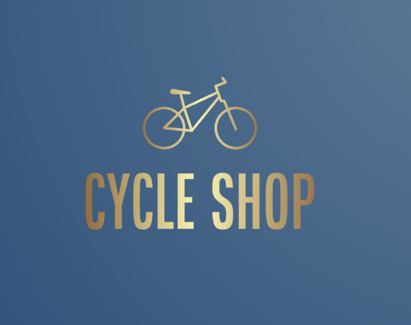

# The Cycle Shop

## Welcome - [The Cycle Shop](https://github.com/jamitag/portfolio-5)
We are an online business specialising in cycling goods including Bikes, Parts and Clothing. Our site will provide users with a smooth online shopping experience all the way the purchase. Our user will also be able to review their favourite items which will help promote additional revenue for the store.

As a ‘Business to Consumer’ (B2C) retailer, we will ship all items to you directly ourselves - no middle men - to avoid any hassle.

We also have an active online presence including FaceBook, Twitter, Instagram and Strava.
 
 
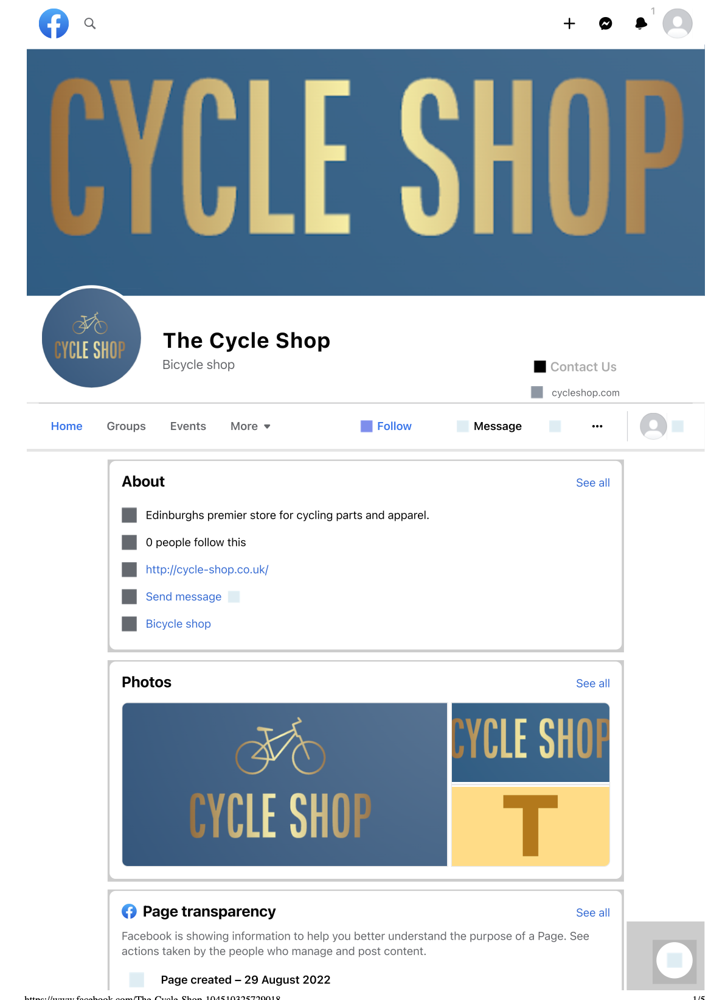

## Features

### Existing Features

__Homepage__

The homepage is deliberately kept simple in order to make the products take centre stage and be the focus of the users attention as soon as they open the site. The categories of products are bold and obvious, with accompanying images, for the user to jump right and begin browsing the area of their choice.

__Navigation Bar__

The Navigation bar appears at the top of all pages maintaining a consistent look across the website. It contains links to a specific areas of the site such as categories, search, login. Additional user and cart functionality becomes available when user logs in.

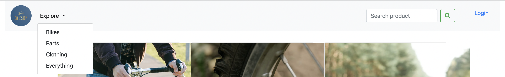

__Profile link__

User profile can be clicked from the navbar. This will only be available to users that are logged in and will be displayed under their username.

__Login link__

Only shown when user is not logged in. The login link in the navbar will direct the user to the login page where they can login or create an account.

__Cart link__

Only available to logged in users. Clicking the cart will direct user to the cart page providing there is items in the users cart, otherwise they will receive an alert. The number of items within the users cart is visible next to the cart icon.

__Username displayed__

Only available to logged in users. Clicking on the username will present the user with two options; ‘Profile’ and ‘Logout’. ‘Profile’ will direct user to the users profile area and ‘Logout’ will log the user out and direct them to a logout page notifying the user they have been logged out and offer an option to sign in again.

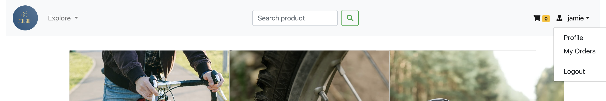

__My Orders__

User can view their order history in the My Orders section.

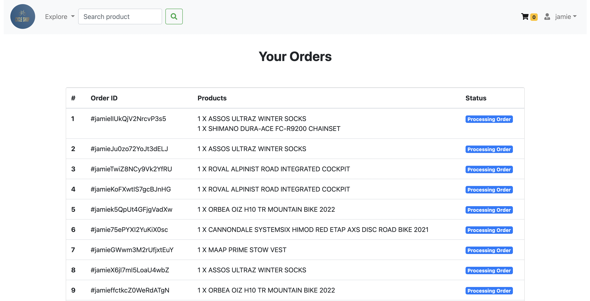

__Categories__

User have a choice to view all products or choose to select one of the product categories found in the navbar.

__Product page__

Users can view images of the products and read a description as well as add a comment. The ‘add to cart’ button will place the item into the users cart.

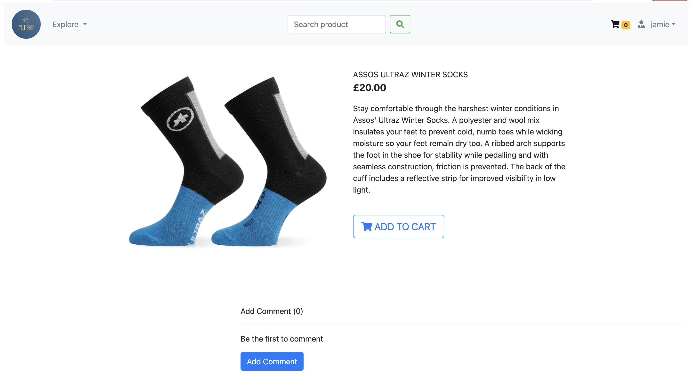

__Profile page__

Users can view and update their profile page including bio and avatar as well as updating their password.

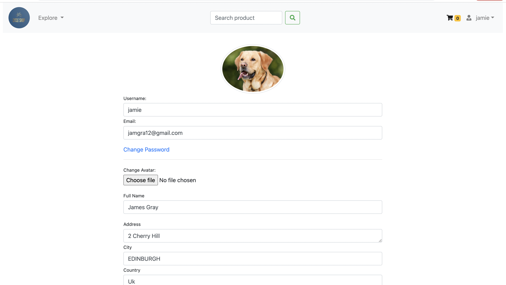

__Cart__

Users can view their shopping cart which will list all items they have ‘Added to cart’, including quantity and a total price for all items. User can adjust the quanity of items in their cart or remove completely.

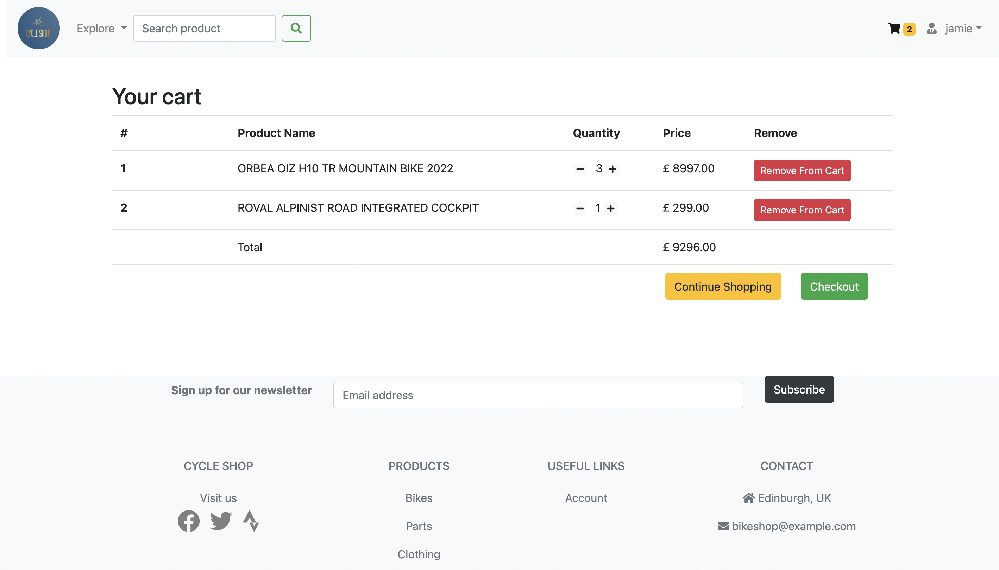

__Checkout__

In the checkout section, users will fill in their delivery details further checkout sections to be included. A list of items to be purchased is also found beside form as well as an order total. The users inout their address, the address will be saved for future use. User cannot proceed to the payment section until all field of delivery address have been complete.

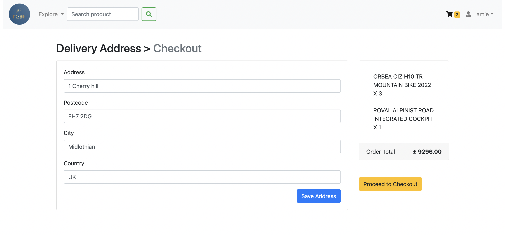

__User notification__

Users will receive alerts throughout this site for various actions, including adding items to cart, removing items from cart, updating profile page, saving address, password change etc.

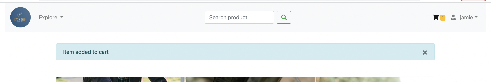

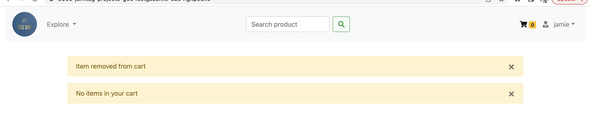

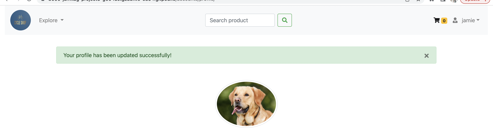

__Add Comment__

Users can add a comment to a particular product which can be seen by other users as a form of review system. The comment will be show alongside the username of the author as well as a time stamp showing the date the comment was made. Comments can also be deleted by the user who created the comment.

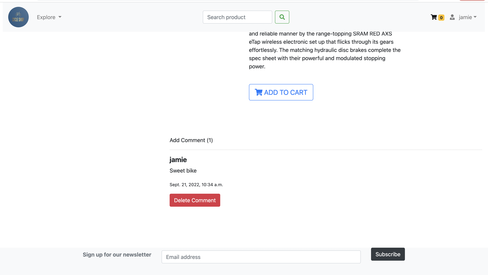

__Footer__

A footer can be found at the foot of every page. This displays links to categories of products as wel as our social media links. User can also enter their email to sign up for our newsletter. Additional contact information can also be found.

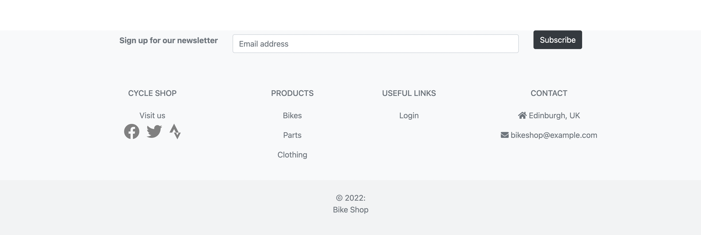

__Payment__

User can purchase their items using the Stripe payment platform.

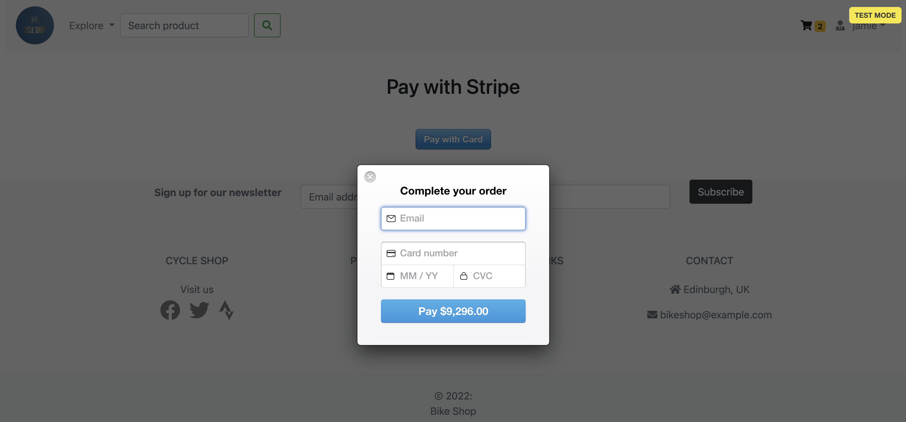

__Payment Success__

User will be directed to the 'order success' page when they purchase an item.

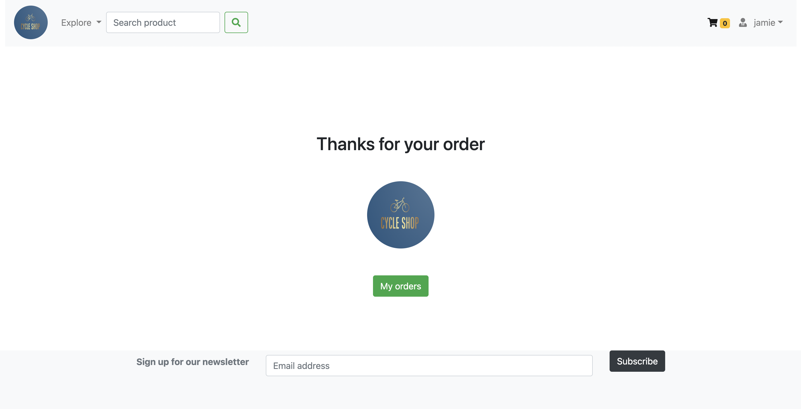

### Features to add

- Create a star rating system for each product.

- Create a Wishlist for customers to add their favourite products.

- Improve stock level on site

## Design
I opted for a simple design, similar to existing sports/cycling stores e.g. [wiggle](https://www.wiggle.com/), where the products themselves are the focus and there isn’t too many graphics and colours to detract from this. I played around with different colours but I liked the simplicity of the white background with light grey navbar and footer and I felt this allowed the products themselves to really jump from the page. I thought this also ensured my logo stood out more; this being the main source of constant visual colour throughout the site.

## Wireframes

I designed the basis of the website using the Goodnotes app. Inspiration for the layout and content came from [wiggle.com](https://www.wiggle.co.uk) and [Sigma sports](https://www.sigmasports.com).

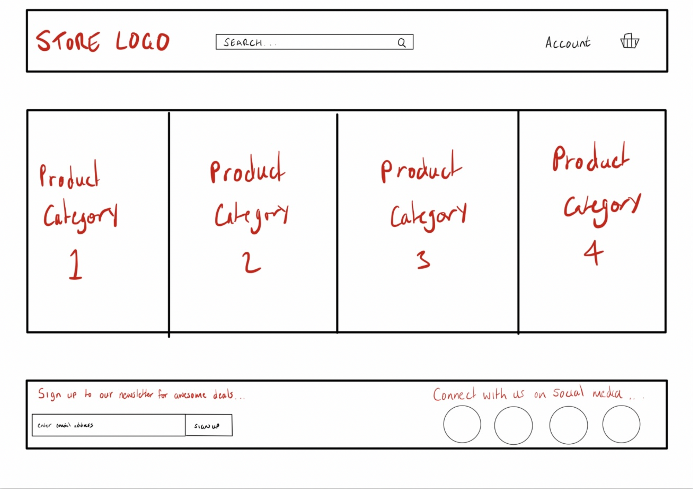

Homepage

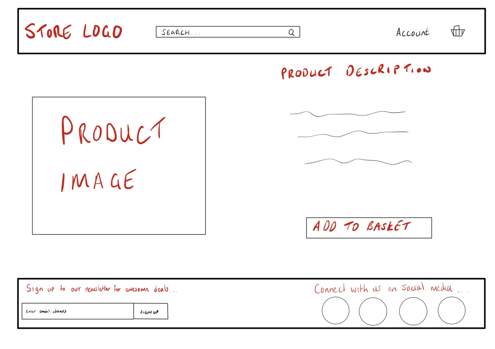

Product page

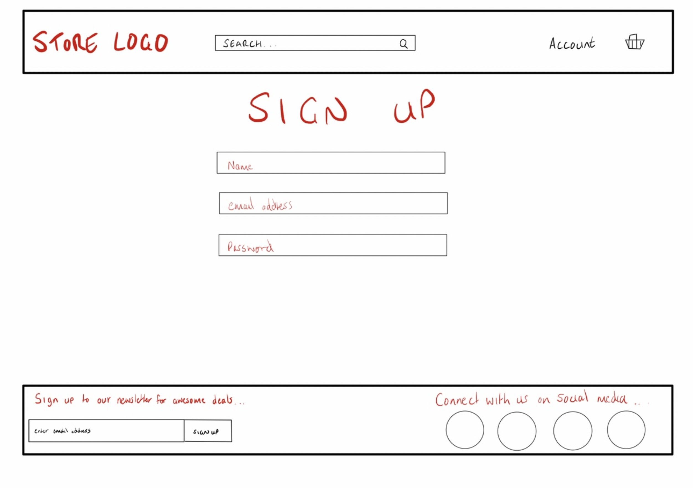

Sign up page

## User Experience (UX)

| User Story: Register for account | 
| ---- | 
| **Site User** |
| I want to to easily register for an account |
| I want to be able to save personal data which speeds up the checkout process in the future |
| **Site Owner** |
| I want customers to register an account with us to improve their experience and as a way to feel connected to the store |
| I want customers to create a profile to build their involvement with the site and feel valued |

| User Story: Login | 
| ---- | 
| **Site User** |
| I want to be able to log in easily |
| Login in should be available an recognisable as soon as I visit the homepage |
| I want to be able to easily logout to protect my information |
| **Site Owner** |
| I want customers to be able to log in with as few clicks as possible |
| I want customers to be able to log out with as few clicks as possible |

| User Story: Change password | 
| ---- | 
| **Site User** |
| I want to be able to easily change my password from within my account |
| **Site Owner** |
| I want customers to maintain safe and secure accounts by updating passwords reguarly |

| User Story: View products by category | 
| ---- | 
| **Site User** |
| I want to view certain type of items |
| I want to visit a category of products with as few clicks as possible |
| I do not want to browse every product unnecessarily |
| **Site Owner** |
| I want customers to find what they need quickly in order to purchase what they need quickly |

| User Story: Search for product | 
| ---- | 
| **Site User** |
| I want to view a specific item |
| I want to easily search for that item from the homepage |
| **Site Owner** |
| I want customers to find what they need quickly in order to purchase what they need quickly |

| User Story: Update quantity of items | 
| ---- | 
| **Site User** |
| I want to adjust the number of items in my cart easily without going into the product page and adding manually |
| I want to be able to be able to remove an item from within the cart |
| **Site Owner** |
| I want the customer to be able to update their basket items easily, which may encourage additional purchases |

| User Story: Update product details | 
| ---- | 
| **Site User** |
| I want items descriptions and images to best reflect item for sale |
| I want to be assured about the item I’m purchasing |
| **Site Owner** |
| I want to be able to update items to suit business needs |

| User Story: Update available products | 
| ---- | 
| **Site User** |
| I want the site content to have a varied amount of in stock items |
| I don’t want unnecessary  ‘unavailable’ items cluttering the product pages |
| **Site Owner** |
| I want items available for purchase to reflect stock levels |

| User Story: Delete items | 
| ---- | 
| **Site User** |
| NA |
| **Site Owner** |
| I want to keep the website updated as much as possible and sell items that are available |

| User Story: Pay securely| 
| ---- | 
| **Site User** |
| I want a fast and secure means to purchase items |
| I want immediate on screen confirmation that a transaction has been successful |
| **Site Owner** |
| I want the site to protect customer data and provide a seamless experience throughout the checkout process to encourage return custom |

| User Story: Order confirmation | 
| ---- | 
| **Site User** |
| I want a record of confirmation as proof of purchase |
| **Site Owner** |
| I want customers to feel assured that their order has been processed and possess a record of their purchase |

## Data Model

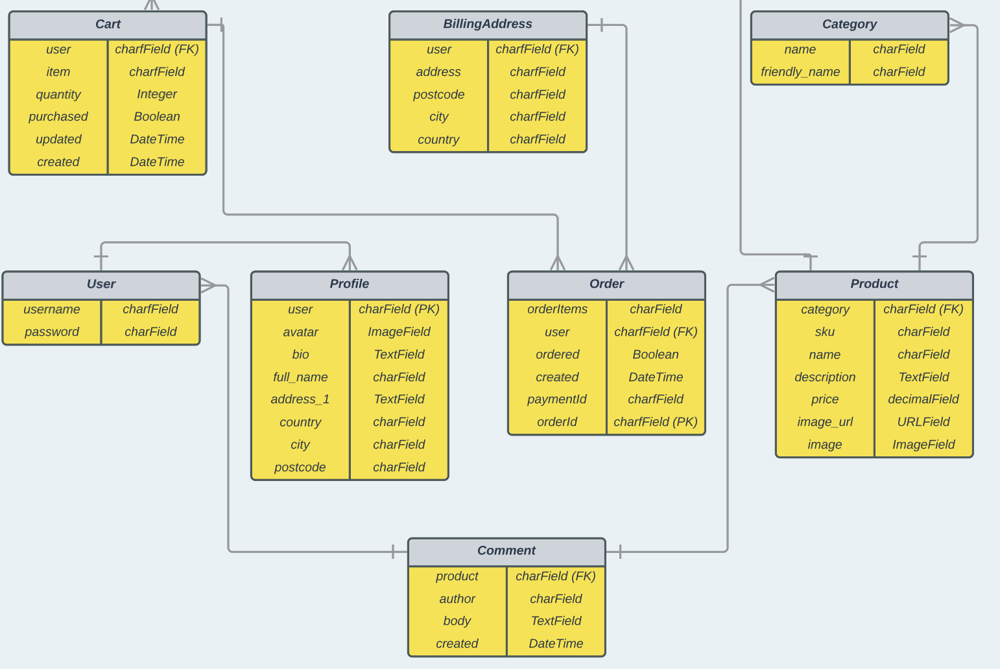

## Testing

### Manual Testing

| Test | Expectation | Working |
| ---- | ------ | --------------- |
| Click logo in Navbar| Take user to homepage | YES |
| Click ‘Login’ (when not logged in) in Navbar| Take user to login section | YES |
| Click ‘Username’ (when logged in) in Navbar| Dropdown showing profile and logout options | YES |
| Click ‘Profile’ (when logged in) in Navbar| User taken to profile section | YES |
| Click ‘Logout’ (when logged in) in Navbar| User logged out | YES |
| Click ‘Explore’ in Navbar (normal user)| Dropdown showing categories of products | YES |
| Click ‘Explore’ in Navbar (superuser)| Dropdown showing categories of products and product management section | YES |
| Click cart icon in Navbar (when logged in and no items have been added to cart)| Users receive alert ‘No items in your cart’ | YES |
| Click cart icon in Navbar (when logged in and there is items added to cart)| Users are directed to cart page where they can view their order | YES |
| Click inside search bar in Navbar | Allows user to type and search| YES |
| Click ‘Bikes’ category image on homepage | Take user to bikes category | YES |
| Click ‘Parts’ category image on homepage | Take user to parts category | YES |
| Click ‘Clothing’ category image on homepage | Take user to clothing category | YES |
| Click ‘Bikes’ category link in footer | Take user to bikes category | YES |
| Click ‘Parts’ category link in footer| Take user to parts category | YES |
| Click ‘Clothing’ category link in footer | Take user to clothing category | YES |
| Click social media links in footer | Take user to relevant social media website in a new page | YES |
| Clicking on any product | Directs user to correct product page | YES |
| Clicking ‘Add to cart’ button | Adds 1 relevant item to the users cart | YES |
| Clicking ‘Add to cart’ button | Users receives alert ‘Item added to cart’ | YES |
| Clicking ‘Add to cart’ button when item is already in cart| Users receives alert ‘The number of items have been updated’ | YES |
| Clicking ‘Add to cart’ button when not logged in | User is directed to the login page | YES |
| Clicking ‘Change password’ link in profile page | Users are directed to password-change page | YES |
| Clicking ‘Choose file’ button in profile page | Prompts users to select a file to update avatar | YES |
| Clicking ‘Save changes’ button in profile page | Saves any updates to profile page | YES |
| Clicking 'Save changes' button in profile page | Users receive alert ‘Your profile has been updated successfully!’ | YES |
| Clicking ‘Reset’ button in profile page | Removes data in Full Name and Address fields | YES |
| Clicking ‘+’ button in cart page | Item within cart is increased by 1 | YES |
| Clicking ‘+’ button in cart page | Users receive alert ‘{item.name} added’ | YES |
| Clicking ‘-’ button in cart page when multiple items are in cart | Item within cart is decreased by 1  | YES |
| Clicking ‘-’ button in cart page when multiple items are in cart | Users receive alert ‘{item.name} removed’ | YES |
| Clicking ‘-’ button in cart page when there is only 1 item in the cart | Users are directed to homepage and receive alert ‘No items in your cart’| YES |
| Clicking ‘Remove from cart’ button in cart page | The selected item is removed from the user cart | YES |
| Clicking ‘Remove from cart’ button in cart page | Users receive alert ‘Item removed from cart’ | YES |
| Clicking ‘Continue Shopping’ button in cart page | Users directed to homepage | YES |
| Clicking ‘Checkout’ button in cart page | Users directed to checkout page | YES |
| Clicking ‘Save changes’ button in checkout page(when complete) | ‘Proceed to Checkout’ button becomes available to press | YES |
| Clicking ‘Save changes’ button in checkout page(when complete) | Users receive alert ‘Delivery address saved’ | YES |
| Clicking ‘Save changes’ button in checkout page(when not complete) | Users receive alert ‘Please provide all information to proceed to payment’ | YES |
| Clicking ‘Make payment’ button in checkout page | Only works if address fields have been completed | YES |
| Clicking ‘Proceed to Checkout’ button in checkout page | Directs user to payment page | YES |
| Clicking ‘Pay with card’ button in payment page | 'Complete Order' pop up requesting card details | YES |
| Entering stripe test card payment details with valid email address and press 'Pay $x' button | Order processes successfully and user directed to success page confirming order | YES |

### Validator Testing

#### Python

I fixed the basic errors from the Problems tab in the terminal using flake8. Additionally, all .py files were ran through <a href="http://pep8online.com">PEP8 linter</a>. Common errors encountered such as ‘Line too long’, ‘Trailing white space’, ‘Black lines’ etc where found. All where tidied up without any concerns.

#### HTML

I opened each web page in the browser and copy the rendered HTML code into the validator in order to avoid errors caused by the Django expressions.
All HTML code was run through [W3C HTML validation service](https://validator.w3.org/nu/). All errors found where cleared without any concerns.

#### CSS

CSS files and style tags where ran through [W3C CSS validation service](https://jigsaw.w3.org/css-validator/) and showed no errors.

#### JavaScript

JavaScript files where validated with [JSHint validator](media/jshint.png) and no errors where found.

### Responsiveness

The site was tested across several devices with varying screen sizes;

- MacBook - 1280 x 1200
- iPad	- 768 x 1024
- iPhone 6/7/8 - 375 x 667

## Issues

**Issue 1** - Whilst preparing the project for deployment, there was a change made that resulted in the login functionality to stop working. I was greeted with a 403 forbidden error when I attempted to login.

**Solution** - I tried undoing the changes made for deployment which did not work. I ultimately had to revert to a previous commit to restore the login functionality. When deployment was attempted again, the same bug appeared. After many attempts at various solutions, downgrading the version of Django from version 4 to 3.2.10 seemed to be the fix that was needed.

**Issue 2** - When validating HTML for the ‘product_detail’ page, using source code from site, I received the following error; No p element in scope but a p end tag seen. This was despite the additional 'p' tag not being present in my product_detail.html page.

**Solution** - It appears adding the linebreak filter was the cause of this issue. I found the following [solution](https://github.com/DjangoGirls/tutorial/issues/776) which removed the error.

**Issue 3** - Several stray tag errors are appearing in my add_comment.html when running the HTML source from browser.

**Solution** - The html file itself is fine and the error seemed to be coming from the block tag pulling a Django form for my forms.py file. I found a similar issue [here](https://stackoverflow.com/questions/38634914/display-django-form-error-for-each-field-in-template-and-each-correct-data-in-te), and when I changed by block tag from {{form}} to {{form.body}}, this removed the warnings.

**Issue 4** - I could not access the site admin at the beginning of the project shortly after setup.

**Solution** -  I found this [solution](https://stackoverflow.com/questions/16068518/django-site-matching-query-does-not-exist) and discovered that simply changing ‘site_id = 1’ ( as instructed in the CI set up video) to ‘SITE_ID=1’ fixed the issue.

**Issue 5** - Django media files not working when debug set to False.

**Solution** - I discovered this [solution](https://stackoverflow.com/questions/55842323/django-media-files-doesnt-work-when-debug-false), which appended the urlpatterns. This displayed my images when debug = False.

## Technologies

### Editor
- GitPod

### Languages
- Python
- HTML5
- CSS3 / bootstrap
- JavaScript

### Template
- Django

### Deployment
- Heroku

### Database
- SQLite
- Postgres (deployed)

### Version control
- GitHub

### Libraries
- Google Fonts
- Stock Images

### Other
- Image resizing - [reduceimages.com](https://www.reduceimages.com/)
- [Lucid](https://lucid.app/)
- Creating store [logo](https://www.logo.com/)
- GoodNotes app
- Stripe payment

## Deployment

This programme was deployed using [Heroku](https://heroku.com/)

### Heroku
1. Log into Heroku, select 'Create new app’.
2. Name your application then within the the dashboard, select settings and scroll down to ‘Reveal Config vars’
3. Enter relevant config vars, remembering to include any environmental variables you have in place.
4. Include Heroku postgres Add on within Resouces tab.
5. Navigate from ‘Settings’ to ‘Deploy’ and select ‘Github’ within the ‘Deployment Method’ section.
6. Search and connect your Github repo in the ‘Connect to Github’ section.
7. Clicking ‘Deploy branch’ will then create your Heroku app and you can view it by clicking the ‘View’ button at the bottom of the page.
	- Selecting ‘Enable Automatic Deploys’ will ensure that your Heroku app is updated each time you push changes from Gitpod otherwise you will have to deploy manually each time using the steps mentioned above.

### Local host
1. Install gunicorn and django_heroku.
2. Update requirements.txt file.
3. Add django_heroku to settings.py.
4. Include static_root settings in settings.py.
5. Create json file containing existing data 'python3 manage.py dumpdata > datadump.json'.
6. Export file with 'python3 manage.py loaddata datadump.json'

## Credits

1. This [resource](https://dev.to/thepylot/how-to-migrate-data-from-sqlite-to-postgresql-in-django-182h) was helpful with managing my data when deploying.

2. Whilst Code Institute resources where great, I found it invaluable gaining additional view from these providers: [Corey Schafer](https://www.youtube.com/watch?v=UmljXZIypDc&list=PL-osiE80TeTtoQCKZ03TU5fNfx2UY6U4p), [Mosh](https://www.youtube.com/watch?v=_uQrJ0TkZlc), and [Net Ninja](https://www.youtube.com/watch?v=n-FTlQ7Djqc&list=PL4cUxeGkcC9ib4HsrXEYpQnTOTZE1x0uc).

3. Boutique ado was incredibly helpful and is also a similar project to my project therefore I was cautious about following the videos too much. Some other resources I used to guide me where; [tutorial 1](https://www.youtube.com/watch?v=YZvRrldjf1Y)[tutorial 2](https://www.youtube.com/watch?v=4xmbHcqyl3I&list=PL_99hMDlL4d2zsGU5nOgADmRc6A8msXyh) [guide 1](https://www.geeksforgeeks.org/e-commerce-website-using-django/)

4. Due to issues noted in 'issue 1', I had to find assistance with deploying app. Several links where helpful including this [tutorial](https://www.youtube.com/watch?v=V2rWvStauak) & [article](https://dev.to/thepylot/how-to-migrate-data-from-sqlite-to-postgresql-in-django-182h).

5. I also found this [article](https://testdriven.io/blog/django-stripe-tutorial/) helpful whwen setting up Stripe.

6. I took my product images and descriptions from [sigma sports](https://www.sigmasports.com/).

### Other

Thank you to Sandeep, my mentor, for providing assistance in this project as well as his guidance throughout the course.